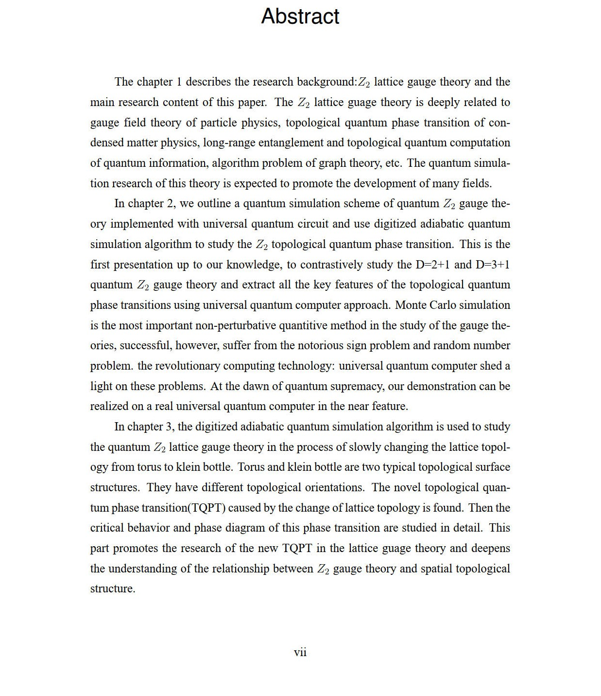

# qz2 : Quantum simulation of Z2 gauge theory and its application in quantum algorithm of graph theory

Chinese Title:
      
      Z2格点规范理论的量子模拟及其在图论量子算法中的应用

Ref：Ph.D. Dissertation 
      [《Quantum simulation of Z2 gauge theory and its application in quantum algorithm of graph theory》](doc/Z2_DocPaper.pdf).  Xiaopeng Cui. Fudan University. 2020-8   

Download Link: [PDF](doc/Z2_DocPaper.pdf)

## Main content:

            1. Quantum simulation of Z2 gauge theory
            2. Topological quantum transition of Z2 gauge theory with the change of lattice topology
            3. Application of Z2 gauge theory quantum simulation in algorithm in Hamiltonian cycle problem（HCP) of graph theory
            4. QBLAS：A quantum basic linear algebra and simulation library
            
## Abstract:

## Abstract (Tex):

\newcommand{\COAO}{$O ( \frac{1}{g_c^2} \sqrt{  \frac{1}{\varepsilon}  N_e^{3/2}( N_v^3 +  \frac{N_e}{g_c} } ) ) $}

The chapter 1 describes the research background:$Z_2$ lattice gauge theory and the main research content of this paper. The $Z_2$ lattice guage theory is deeply related to gauge field theory of particle physics, topological quantum phase transition of condensed matter physics, long-range entanglement and topological quantum computation of quantum information, algorithm problem of graph theory, etc. The quantum simulation research of this theory is expected to promote the development of many fields.

In chapter 2, we outline a quantum simulation scheme of quantum $Z_2$ gauge theory implemented with universal quantum circuit and use digitized adiabatic quantum simulation algorithm to study the $ Z_2 $ topological quantum phase transition. This is the first presentation up to our knowledge, to contrastively study the D=2+1 and D=3+1 quantum $Z_2$ gauge theory and extract all the key features of the topological quantum phase transitions using universal quantum computer approach.  Monte Carlo simulation is the most important non-perturbative quantitive method in the study of the gauge theories, successful, however, suffer from the notorious sign problem and random number problem. the revolutionary computing technology: universal quantum computer shed a light on these problems. At the dawn of quantum supremacy, our demonstration can be realized on a real universal quantum computer in the near feature.

In chapter 3, the digitized adiabatic quantum simulation algorithm is used to study the quantum $Z_2$ lattice gauge theory in the process of slowly changing the lattice topology from torus to klein bottle. Torus and klein bottle are two typical topological surface structures. They have different topological orientations. The novel topological quantum phase transition(TQPT) caused by the change of lattice topology is found. Then the critical behavior and phase diagram of this phase transition are studied in detail. This part promotes the research of the new TQPT in the lattice guage theory and deepens the understanding of the relationship between $Z_2$ gauge theory and spatial topological structure.

In chpater 4, using the condensed close string characteristics of $Z_2$ topological quantum phase transition, by mapping a graph to a lattice we develop a quantum algorithm with time complexity \COAO to obtain the closed string condensate of its corresponding lattice, which is helpful to solve the Hamilton cycle problem (HCP) of the graph. Using this algorithm model, by the simulation of a number of small random graphs we find that the number of Hamiltonian cycles in a graph has a significant effect on the critical parameter $g_c$ of $Z_2$ topological quantum phase transition of its corresponding lattice, the average of $g_c$ with $\sqrt{N_ {hc}} $($N_e,N_v$ is fixed) and the average of $\frac{1}{g_c} $ with $N_e$($N_v$ is fixed) are all a linear relationship. Based on this, we further discuss the possibility of a algorithm which uses $g_c$ to infer the number of Hamiltonian cycles in a graph on a quantum computer.

In chapter 5, an open source quantum basic linear algebra and quantum simulation library(QBLAS) is developed based on the newest Q\# quantum programming language of Microsoft. With the rapid development of quantum computing software and hardware, various quantum algorithms characterized by quantum linear algebra spring up like mushrooms. These algorithms exponentially accelerate various computational and machine learning tasks. In addition, as the killer application of quantum computing, quantum simulation has unique advantages in solving monte carlo symbol problems, strong correlation problems and non-equilibrium dynamics simulation problems. With this trend, it is necessary to systematically develop an algorithm library focus on quantum basic linear algebra and quantum simulation algorithm for welcoming the arrival of the quantum era. QBLAS is such a quantum algorithm library. 

The chapter 6 summarizes the work in this article and discusses the future development of the field. By adiabatic quantum simulation of $Z_2$ lattice gauge theory , this article studies the characteristics of its topological quantum phase transition , novelty behavior when the changes of spatial topology, as well as wonderful interaction with HCP problem of graph theory. These results will drive the further integration of lattice gauge theory, topology, graph theory and quantum computing.

